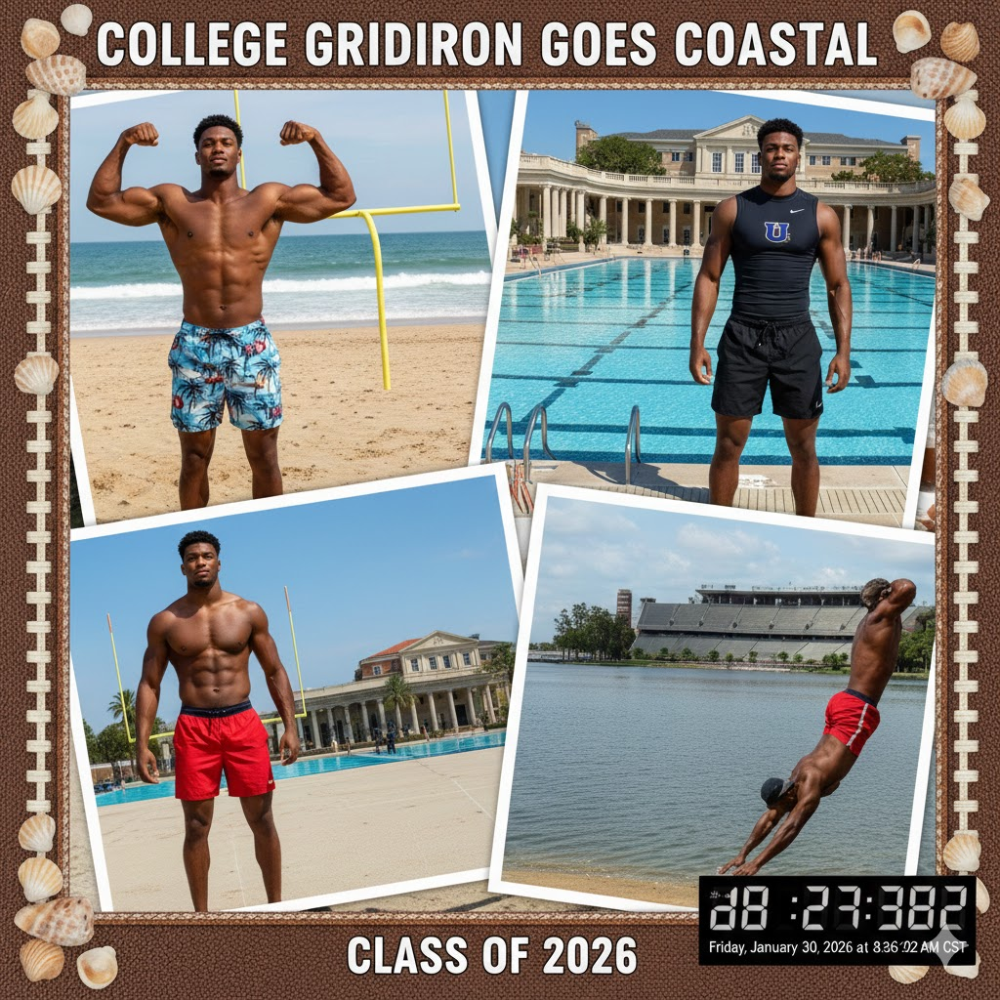
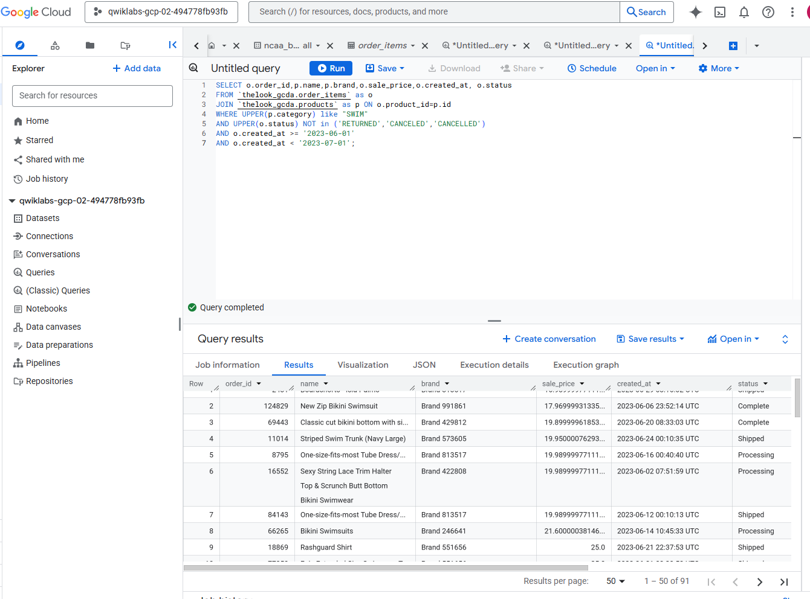
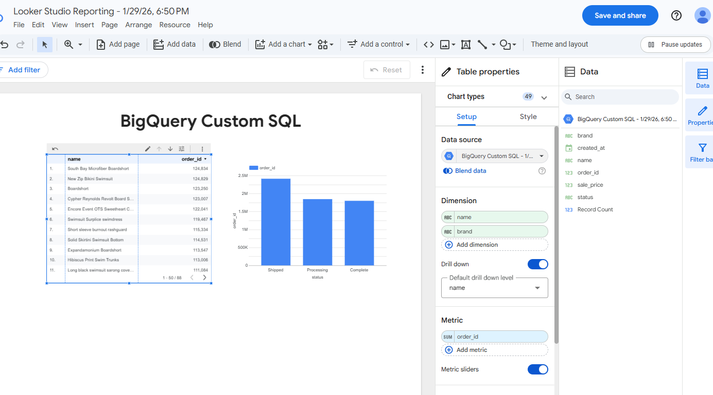
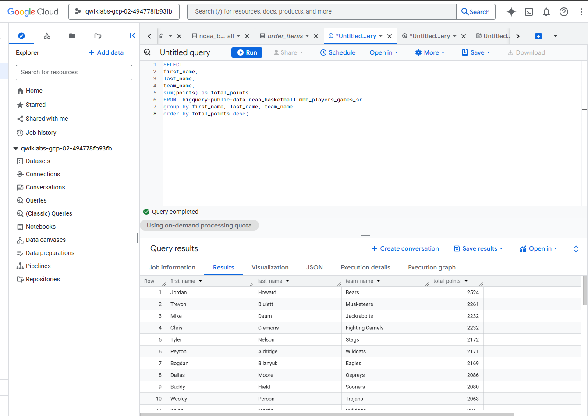
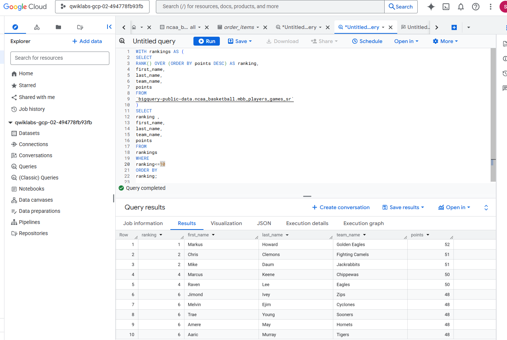
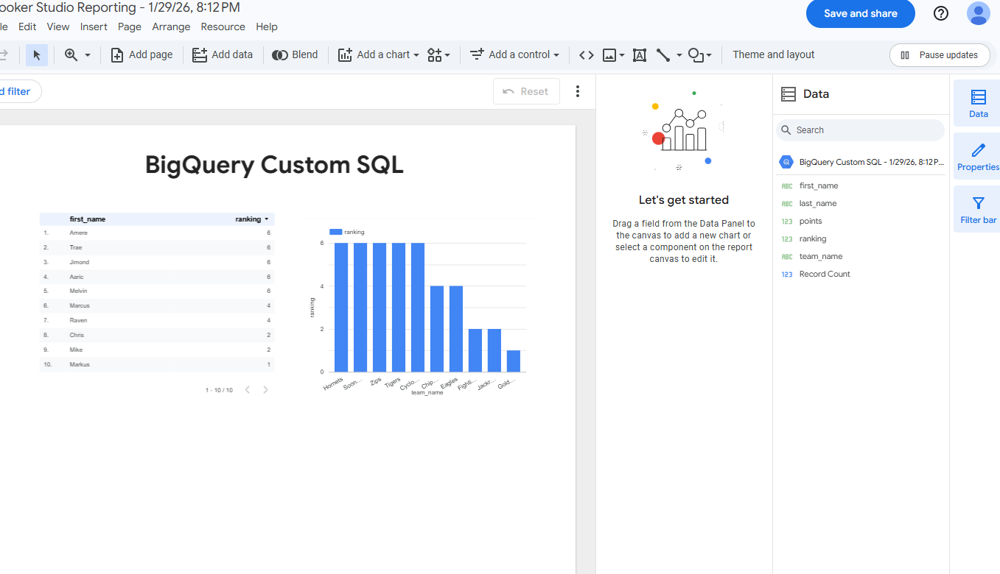

# FabMe-online-clothing-shop Ad Campaign
### Marketing Analysis to run a campaign to promote swimwear products by modeling highest scoring college basketball players from NCCA using BigQuery and Looker Studio

FabMe Swimware Ad Campaign with NCCA Top Football Players

FabMe - a global company that sells clothing products through physical stores and through digital channels including their own website, their own mobile app, and various third-party social media apps. TheLook eCommerce has been growing quickly thanks to the company’s wide variety of clothing styles, focus on innovation, and commitment to ethical and sustainable sourcing.

## Table of contents
* [Project Title](#project-title)
* [Description](#description)
* [Data WorkFlow](#data-workFlow)
* [Objective](#objective)
* [Analysis 2020](#analysis-2020)
* [Technologies and Tools](#technologies-and-tools)
* [Code](#code)
* [Status](#status)
* [Contact](#contact)

## Project Title : FabMe - Online Clothing Shop Marketing Analysis to Run a Ad Campaign

### Description 
This project aims at analyzing top swimware sales in June 2023 and identifying top 10 football players from NCCA to model. 

### Data WorkFlow 
* Clarify and Answer Business Questions
* Create Objectives
* Capture Data
* Analysis
* Vizualize and Report

### Business Question 1 : Promote swimwear products with highest sales in June 2023
1. What is data am I looking for?
   - Sales and Products
3. Where to find the data?
   - BigQuery Database
5. How much data?
   - June 2023
7. What tools are neded to analyze , Vizualize and Report?
   - BigQuery , SQL & Looker
  
### Business Question 2 : Top 10 NCCA Football Players past 5 years
1. What is data am I looking for?
   - NCCA Player with points
3. Where to find the data?
   - Public data source -NCCA dataset
5. How much data?
   - past 5 years
7. What tools are neded to analyze , Vizualize and Report?
   - BigQuery , BigQuery Search, SQL & Looker
  
##Create Objectives
1. Identify the Product and sales data set on Bigquery for june 2023
2. Identify highest selling swimware product with status (complete, processing, ordered)
3. Identify NCCA player public dataset with players and their highest scoring points in last 5 years
4. Visualize and Report to the manager
		
### Capture Data   
### Data Sets:
1. Order_items data and products data from BigQuery
2. NCCA Football players scoring data.

### Analysis

#### Step 1 - 
1. Join order_item and Products table using SQL query
2. Filter Swim items
3. Identify swim items that are sold, processing, ordered status in june

5. Vizualize to see the highest sold product in June
   
 
7. Report	
    
### Step 2 
1. Gather public data form NCCA 
2. Identify highest scoring players
 
3. Rank thm from one to ten.

4. Vizualize and Report
 

### Step 3 - 
- Reporting
 - Create a README that report summerizing the most sold products in June 2023 and Top 10 best scoring Football players from NCCA for the Swimware Ad Campaign.

## Tech Stack
* BigQuery
* Looker Studio
* SQL

## Status
Project Complete

## Contact
 [Divya Shetty](www.linkedin.com/in/divya-shetty-k)

